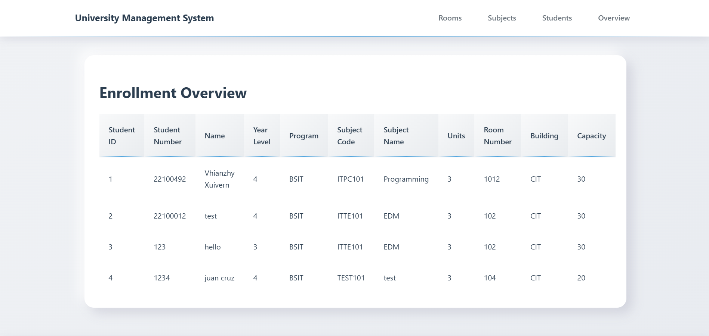
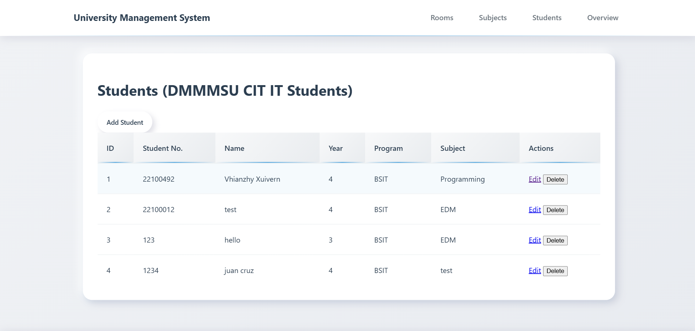
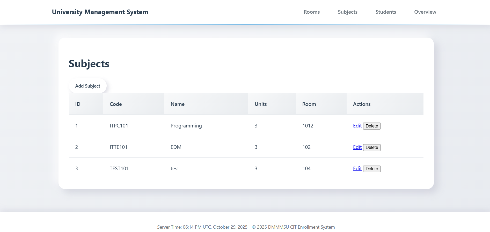
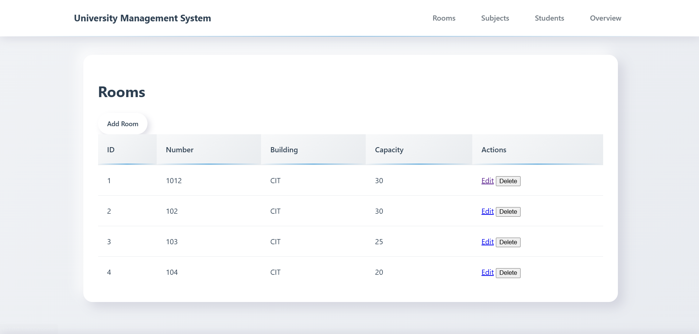

# University Enrollment Transaction Processing System  (Midterm Project)

A **University Enrollment Transaction Processing System (TPS)** built using the **Laravel PHP Framework** to manage **Students, Subjects, and Rooms** with a clean, responsive, and user-friendly interface.

---

## Description / Overview

This is a **web-based Enrollment Management System** designed to perform **CRUD operations** on **Students**, **Subjects**, and **Rooms**. The system includes:
- A **Students module** that records each student’s number, name, year level, program, and enrolled subject.
- A **Subjects module** for creating and managing available subjects.
- A **Rooms module** for managing room assignments (optional per design).
- An **Overview page** that lists all students with their assigned subject and basic details.

The data model follows simple, practical relationships (e.g., **Student belongs to Subject**) to keep the design straightforward while remaining extensible for future features (e.g., many-to-many enrollments).

---
---

## Objectives

- Implement **MVC architecture** using Laravel.
- Use **related database tables** with proper fields and relationships.
- Demonstrate **CRUD operations** for Students, Subjects, and Rooms.
- Provide an **overview page** showing consolidated lists.
- Use **Blade templating** and **Eloquent ORM** following Laravel conventions.
- Ensure a **responsive UI** with modern styles (Bootstrap/Tailwind or your chosen CSS).
---

## Features / Functionality

| Feature | Description |
|--------|-------------|
| **Students CRUD** | Add, edit, delete, and view students (student no., name, year level, program, subject). |
| **Subjects CRUD** | Manage subjects (create, edit, delete, view). |
| **Rooms CRUD** | Manage rooms (create, edit, delete, view). |
| **Overview Page** | Displays a list of students with their basic details and enrolled subject. |
| **Eloquent Relationships** | `Student` → `Subject` (**belongsTo**). |
| **Validation** | Validate required inputs and formats for reliable data entry. |
| **Clean UI** | Simple, mobile-friendly pages using Laravel Blade and CSS framework of choice. |


---

## Installation Instructions

### Prerequisites
- PHP >= 8.1
- Composer
- MySQL
- Node.js & NPM (optional for asset compilation)
- Git

### Steps

1. **Clone the repository**
   ```bash
   git clone https://github.com/xuivrn/-GitHub-Collaboration.git
   cd YOUR_REPO_NAME
2. **Install dependencies**
    composer install
3. **Copy .env file**
    cp .env.example .env
4. **Generate app key**
    php artisan key:generate
5. **Configure database in .env**
DB_CONNECTION=mysql
DB_HOST=127.0.0.1
DB_PORT=3306
DB_DATABASE=enrollment_db
DB_USERNAME=root
DB_PASSWORD=
6. **Run migrations**
    php artisan migrate
7. **(Optional) Seed sample data**
    php artisan db:seed
8. **Start the server**
    php artisan serve
9. **Open in browser**
    http://127.0.0.1:8000

--

##  Project Structure

```
ENROLLMENT-SYSTEM/
│
├── app/
│   ├── Http/
│   │   └── Controllers/
│   │       ├── Controller.php
│   │       ├── RoomController.php
│   │       ├── StudentController.php
│   │       └── SubjectController.php
│   │
│   ├── Models/
│   │   ├── Room.php
│   │   ├── Student.php
│   │   ├── Subject.php
│   │   └── User.php
│   │
│   └── Providers/
│
├── bootstrap/
├── config/
├── database/
│   ├── factories/
│   ├── migrations/
│   │   ├── 0001_01_01_000000_create_users_table.php
│   │   ├── 0001_01_01_000001_create_cache_table.php
│   │   ├── 0001_01_01_000002_create_jobs_table.php
│   │   ├── 2025_09_20_162620_create_rooms_table.php
│   │   ├── 2025_09_20_162630_create_subjects_table.php
│   │   └── 2025_09_20_162639_create_students_table.php
│   │
│   └── seeders/
│
├── public/
│   ├── css/
│   │   ├── app.css
│   │   └── styles.css
│   │
│   ├── js/
│   ├── resources/
│   ├── .htaccess
│   ├── favicon.ico
│   ├── index.php
│   └── robots.txt
│
├── routes/
│   ├── console.php
│   └── web.php
│
├── screenshots/
├── storage/
├── tests/
├── vendor/
│
├── .editorconfig
├── .env
├── .env.example
├── .gitattributes
├── .gitignore
├── artisan
├── composer.json
├── composer.lock
├── database.sqlite
├── package.json
├── phpunit.xml
├── README.md
└── vite.config.js

```

---


## Usage
**Overview (/)**
- A simple landing or dashboard page can summarize counts or list all students with their subjects.
**Students (/students)**

- Click Add Student to create new records.
- Edit or Delete from the list.
- Each student can be linked to a Subject.


**Subjects (/subjects)**
- Manage the catalog of subjects that students can be enrolled in.

**Rooms (/rooms)**
-(If implemented) Manage room records that can later be associated with classes or schedules.

## Screenshots

### Home Page (Enrollment Overview)


### Student CRUD 


### Add New Subject Form


### Roomms Management



# Code Snippets

## 🧩 Student Model – Relationship

**File:** `app/Models/Student.php`

This snippet shows the author relationship defined in the **Book** model.
```php
<?php

namespace App\Models;

use Illuminate\Database\Eloquent\Factories\HasFactory;
use Illuminate\Database\Eloquent\Model;

class Student extends Model
{
    use HasFactory;

    protected $fillable = ['student_number', 'name', 'year_level', 'program', 'subject_id'];

    public function subject()
    {
        return $this->belongsTo(Subject::class);
    }
}
```

---

## 🔍 student & Pagination in Controller

**File:** `app/Http/Controllers/StudentController.php`
```php
public function store(Request $request)
    {
        $request->validate([
            'student_number' => 'required|unique:students',
            'name' => 'required',
            'year_level' => 'required|integer|min:1|max:4',
            'program' => 'required',
            'subject_id' => 'required|exists:subjects,id',
        ]);
        Student::create($request->all());
        return redirect()->route('students.index')->with('success', 'Student added!');
    }
```

---

## 📄 Pagination Links in Blade

**File:** `resources/views/subjects/index.blade.php`
```@extends('layouts.app')

@section('content')
<div class="neo-card">
    <h1 class="text-2xl font-bold mb-4">Add Subject</h1>
    <form action="{{ route('subjects.store') }}" method="POST">
        @csrf
        <div><label>Code</label><input type="text" name="code" required></div>
        <div><label>Name</label><input type="text" name="name" required></div>
        <div><label>Units</label><input type="number" name="units" required></div>
        <div><label>Room</label>
            <select name="room_id" required>
                @foreach(\App\Models\Room::all() as $room)
                <option value="{{ $room->id }}">{{ $room->number }}</option>
                @endforeach
            </select>
        </div>
        <button type="submit" class="neo-btn text-green-700">Save</button>
    </form>
</div>
@endsection
```

---


## Contributors
 - Full Name – Vhianzhy Xuivern Dumpit
 - Student ID: 221-0049-2 | Section: 4-B
 - BS-Information Technology
    ####  In partnership with Tiffany Kyle Olivar


 ##  License

This project is developed for educational purposes as part of a subject requirment.

---

##  Contact

For contact:
- **Email:** [vhianzhyxuivern1205@gmail.com]
- **GitHub:** [https://github.com/xuivrn](https://github.com/xuivrn)
